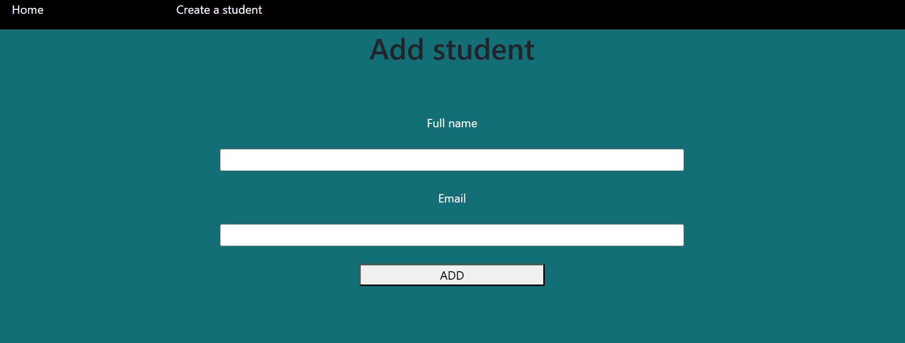
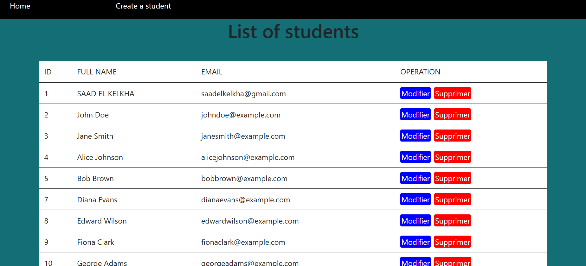

# Student-Management-System-MVC
This a web-based Student Management System built with PHP, MySQL, and jQuery. It enables users to perform CRUD operations on student records, featuring a navigation header for easy page access. Utilizing the MVC architecture separates application logic, presentation, and data handling, ensuring efficient management of student information.

Here's a description of each file in the MVC (Model-View-Controller) structure:

### Main Files
1. **create.php**
   
   - **Description**: Includes the `createAction()` function from the `student_controller.php` file. This action is responsible for displaying the form to create a new student.
   - **Code**:
     ```php
     <?php
         require_once 'controller/student_controller.php';
         createAction();
     ?>
     ```

3. **delete.php**
   - **Description**: Includes the `destroyAction()` function from the `student_controller.php` file. This action handles the deletion of a student record.
   - **Code**:
     ```php
     <?php
         require_once 'controller/student_controller.php';
         destroyAction();
     ?>
     ```

4. **edit.php**
   
   - **Description**: Includes the `editAction()` function from the `student_controller.php` file. This action is responsible for displaying the form to edit an existing student's details.
   - **Code**:
     ```php
     <?php
         require_once 'controller/student_controller.php';
         editAction();
     ?>
     ```

6. **index.php**
   
   - **Description**: Includes the `listStudentAction()` function from the `student_controller.php` file. This action lists all students.
   - **Code**:
     ```php
     <?php
         require_once 'controller/student_controller.php';
         listStudentAction();
     ?>
     ```

8. **store.php**
   - **Description**: Includes the `storeAction()` function from the `student_controller.php` file. This action handles storing the new student data into the database.
   - **Code**:
     ```php
     <?php
         require_once 'controller/student_controller.php';
         storeAction();
     ?>
     ```

9. **update.php**
   - **Description**: Includes the `updateAction()` function from the `student_controller.php` file. This action updates the student's details in the database.
   - **Code**:
     ```php
     <?php
         require_once 'controller/student_controller.php';
         updateAction();
     ?>
     ```

### View Files
7. **views/layout.php**
   - **Description**: Defines the layout for the web pages, including the navigation and styling.
   - **Code**:
     ```html
     <!DOCTYPE html>
     <html lang="en">
     <head>
         <meta charset="UTF-8">
         <meta name="viewport" content="width=device-width, initial-scale=1.0">
         <link rel="stylesheet" href="https://cdn.jsdelivr.net/npm/bootstrap@5.3.2/dist/css/bootstrap.min.css" rel="stylesheet" integrity="sha384-T3c6CoIi6uLrA9TneNEoa7RxnatzjcDSCmG1MXxSR1GAsXEV/Dwwykc2MPK8M2HN" crossorigin="anonymous">
         <script src="https://cdn.jsdelivr.net/npm/bootstrap@5.3.2/dist/js/bootstrap.bundle.min.js" integrity="sha384-C6RzsynM9kWDrMNeT87bh95OGNyZPhcTNXj1NW7RuBCsyN/o0jlpcV8Qyq46cDfL" crossorigin="anonymous"></script>
         <title>Document</title>
         <style>
             body{
                 display: flex;
                 flex-direction: column;
                 align-items: center;
             }
             table{
                 width: 100%;
             }
             tr:hover{
                 background-color: black;
                 color: white;
             }
             td{
                 padding:10px;
             }
         </style>
     </head>
     <body style="background-color:rgb(20,110,118);width:100%;min-height:100vh">
         <?php require_once 'include/nav.php' ?>
         <h1 align="center"><?= $title ?></h1>
         <hr>
         <?= $content ?>
     </body>
     </html>
     ```

8. **views/list_student.php**
   - **Description**: Displays a list of students in a table format.
   - **Code**:
     ```php
     <?php
         $title = "List of students";

         ob_start();
     ?>
     <table style="background-color:white;margin-right:2%;margin-left:2%;width:85%">
         <tr style="border-bottom: 2px solid">
             <td>ID</td>
             <td>FULL NAME</td>
             <td>EMAIL</td>
             <td>OPERATION</td>
         </tr>
         <?php
             foreach ($students as $row){
         ?>
             <tr style="border-bottom: 1px solid">
                 <td><?php echo $row['ID'] ?></td>
                 <td><?php echo $row['NOM'] ?></td>
                 <td><?php echo $row['EMAIL'] ?></td>                   
                 <td>
                     <a href="edit.php?id=<?php echo $row['ID'] ?>" style="background-color:blue;text-decoration:none;padding:2px;border-radius:3px;margin-right:3px;color:white;">Modifier</a>
                     <a href="delete.php?id=<?php echo $row['ID'] ?>" style="background-color:red;text-decoration:none;padding:2px;border-radius:3px;margin-right:3px;color:white;">Supprimer</a>
                 </td>
             </tr>
         <?php
             }
         ?>
     </table>
     <?php $content = ob_get_clean(); ?>
     <?php include_once 'views/layout.php'; ?>
     ```

9. **views/edit.php**
   - **Description**: Displays a form to edit an existing student's details.
   - **Code**:
     ```php
     <?php
         $title = "Modify student";

         ob_start();
     ?>
     <form method="post" action="update.php" >
             <lable for="name">Full name</lable><br>
             <input type="text" id="name" name="name" value="<?php echo $data[1] ;?>"><br>

             <lable for="email">Email</lable><br>
             <input type="text" id="email" name="email" value="<?php echo $data[2]; ?>"><br>

             <input type="hidden" value="<?php echo $data[0] ?>" name="id">

             <button type="submit">MODIFY</button>
     </form>
     <?php $content = ob_get_clean(); ?>
     <?php include_once 'views/layout.php'; ?>
     ```

10. **views/create.php**
    - **Description**: Displays a form to create a new student.
    - **Code**:
      ```php
      <?php
          $title = "Add student";

          ob_start();
      ?>
      <style>
              form{
                  width: 100%;
                  height: 100vh;
                  display: flex;
                  flex-direction: column;
                  text-align: center;
                  align-items:center;
                  padding-top:2%;
                  color:white;
              }
              input{
                  width: 50%;
              }
              button{
                  width: 20%;
              }
      </style>
      <form method="post" action="store.php">
              <lable for="name">Full name</lable><br>
              <input type="text" id="name" name="name"><br>

              <lable for="email">Email</lable><br>
              <input type="email" id="eamil" name="email"><br>

              <button type="submit" name="ajouter">ADD</button>
      </form>
      <?php $content = ob_get_clean(); ?>
      <?php include_once 'views/layout.php'; ?>
      ```

11. **views/include/nav.php**
    - **Description**: Provides navigation links for the application.
    - **Code**:
      ```html
      <nav style="display:flex;text-decoration:none;flex-direction:row;justify-content: center;background-color:black;padding-right:2%;width:100%">
              <ul style="list-style-type:none;display:flex;align-content: center;width:100%;color:white;gap:15%">
                  <li><a href="index.php" style="text-decoration:none;color:white;">Home</a></li>
                  <li><a href="create.php" style="text-decoration:none;color:white;">Create a student</a></li>
              </ul>
      </nav>
      ```

### Model Files
12. **model/student.php**
    - **Description**: Contains functions for database operations related to the student entity.
    - **Code**:
      ```php
      <?php 
          function database_connection(){
              return new PDO("mysql:host=localhost;dbname=mydb","root","123");;
          }
          function list_student(){
              $conn = database_connection();

              $data = $conn->query("SELECT * FROM etudiant")->fetchAll(PDO::FETCH_ASSOC);
              return $data;
          }
          function add(){
              $name = $_POST['name'];
              $email = $_POST['email'];

              $conn = database_connection();
              $sqlstate = $conn -> prepare('insert into etudiant values(NULL,?,?)');
              return $sqlstate -> execute([$name,$email]);
          }
          function destroy($id){
              $conn = database_connection();
              $query = $conn->prepare('DELETE FROM etudiant WHERE ID=?');
              $exe = $query->execute([$id]);
          }

          function veiw($id){


              $conn = database_connection();
              $res = $conn->prepare("SELECT * FROM etudiant WHERE ID=?");
              $res->execute([$id]);
              return $res->fetch(PDO::FETCH_NUM);
          }
          function edit($id,$name,$email){
              $conn = database_connection();
              $sqlstate = $conn -> prepare('UPDATE etudiant SET nom = ? , email = ? WHERE ID = ?');
              return $sqlstate -> execute([$name,$email,$id]);
          }
      ?>
      ```

### Controller File
13. **controller/student_controller.php**
    - **Description**: Contains the main actions (list, create, store, destroy, edit, update) that handle the business logic for the student entity.
    - **Code**:
      ```php
      <?php
          require_once 'model/student.php';
          function listStudentAction(){
              $students = list_student();
              require_once 'views/list_student.php';
          }
          function createAction(){
              require_once 'views/create.php';
          }
          function storeAction(){
              add();
              header('location:index.php');
          }
          function destroyAction(){
              destroy($_GET["id"]);
              header('location:index.php');
          }
          function editAction(){
              $data = veiw($_GET["id"]);
              require_once 'views/edit.php';
          }
          function updateAction(){
              $name = $_POST['name'];
              $email = $_POST['email'];
              $id = $_POST['id'];
              edit($id,$name,$email);
              header('location:index.php');
          }
      ?>
      ```
